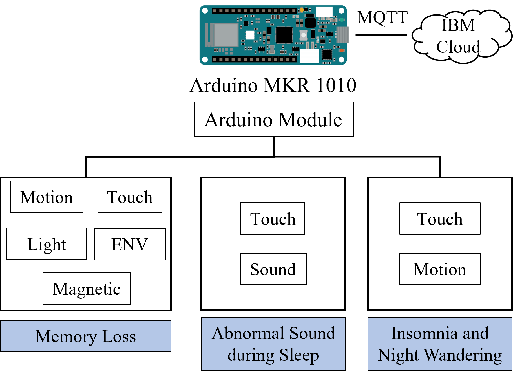

# ELEC0130_21-22_Internet-of-Things-

# 1. Brief introduction

As the population ages, a rising number of elderly are plagued by a variety of age-related disorders. For example, dementia is one of the most prevalent diseases among the elderly, affecting more than 50 million people globally and anticipated to quadruple in prevalence by 2050. In such a situation, it is not only expensive for medical care-delivery systems, but also cumbersome and time-consuming for patients to receive treatment in the conventional manner. 

Thus, it is critical to develop a variety of automated systems that can assist in recognizing the onset or progression of related ageing diseases such as dementia, reminding caregivers when appropriate, performing long-term observation and statistics, and so on. Fortunately, with the rapid growth of Internet of Things (IoT) and Machine Learning (ML) techniques in recent years, these system designs are becoming a reality and assisting in the saving of massive amounts of human resources.

The IoT stack is shown below:


# 2. Organization of the files

## 2.1. Phase I

### 2.1.1. Arduino

This folder contains the sketches of sensors and actuators.

Sensors selection for three symptoms of dementia is shown below. 

- 

Actuators contain the LED light, buzzer and LCD screen.

### 2.1.2. NodeRED

This folder contains the logic of abnormal behaviors recognition and deterioration justification process by .json files on NodeRED.

Specifically, the situations contain abnormal sound during sleep, insomnia, night wandering, memory loss, patient calls for help and traffic monitor.

Furthermore, the NodeRED has configured the Dashboard (User Interface) which provides the data monitoring and other advanced functions for the health team and patients.

## 2.2. Phase II

### 2.2.1. Datasets

The columns of the original CASAS datasets contain date, time, sensor types, sensor status and activity labels.

### 2.2.2. EDA

This folder contains:

1.  the codes written in python for drawing the Visualization of Activity Occurrence of CASAS Dataset. 
2. the codes written in MATLAB for drawing the heat maps of floor-plan.

It is noticed that some EDA is written in file "Activity Statistics and Abnormal Identification"

3. The frequency and duration of per activity in time series.
4. The correlation matrix of every activity.
5. Moving Average analysis for every activity's duration and frequency in time series.

### 2.2.3. Activity Recognition

This file is written in python which employs Random Forest to recognize which activity type an input sensor data item belongs to.

Meanwhile, there are some testing results including mutual information matrix, classification report, and feature importance figures.

### 2.2.4. Activity Statistics and Abnormal Identification

This file aims to determine if the a new incoming activity event is abnormal based on the acquired historical activity data and the knowledge obtained from EDA.

Meanwhile, there are some testing results including classification report, feature importance figures and ROC curves.

### 2.2.5. LSTM Prediction

This part adopts a time-series model to predict the happening frequency or time span of a specific activity in the future.

### 2.2.6. images

Containing all results mentioned above.

### 2.2.7. models

Containing the trained LSTM in this work.

## Tips. DO NOT CHANGE THE FILE LEVEL

```
├─Phase I
│  ├─Arduino
│  │  ├─AbnormalSound_and_NightWandering
│  │  └─MemoryLoss
│  └─NodeRED
└─Phase II
    ├─classification_report
    ├─Datasets
    ├─EDA_code
    │  └─Matlab_heatmaps
    │      └─Matlab_heatmaps
    ├─heatmap on floorplan
    ├─images
    │  ├─images_AbnormalIdentification
    │  │  ├─feature_importance
    │  │  └─KMeans_results
    │  ├─images_ActivityRecognition
    │  │  └─importance_per_activity
    │  ├─images_EDA
    │  │  ├─correlations
    │  │  ├─freq_span
    │  │  │  └─z-score
    │  │  ├─heatmap_floorplan
    │  │  └─time_series_patterns
    │  └─images_LSTM
    └─models
        └─LSTMWithoutAux
            └─variables
```


